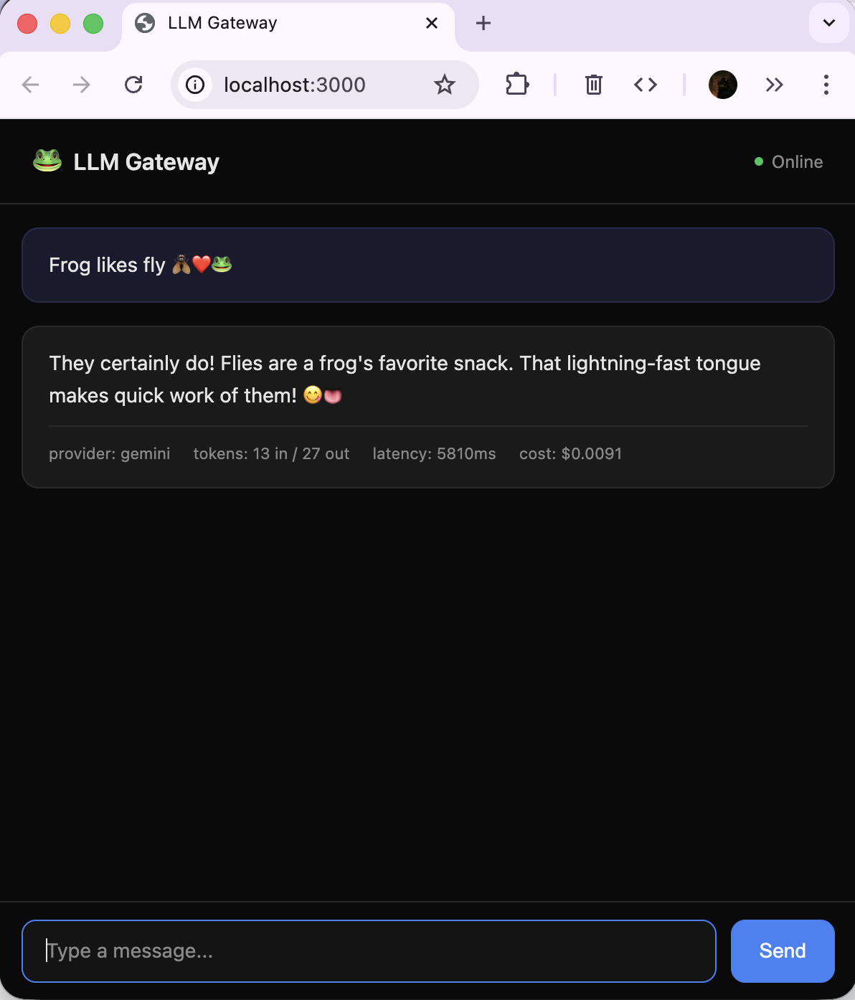
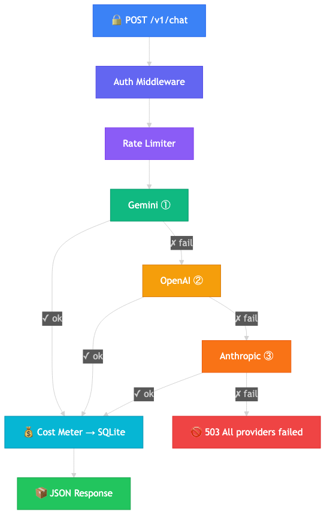

# LLM Gateway


A proxy server between your application and LLM providers. Single entry point for all AI requests with built-in reliability and cost control.

## How It Works

<table>
<tr>
<td width="50%">

</td>
<td width="50%">

</td>
</tr>
<tr>
<td align="center"><sub>Built-in chat playground</sub></td>
<td align="center"><sub>Request flow & fallback chain</sub></td>
</tr>
</table>

1. `POST /v1/chat` with `Authorization: Bearer <key>`
2. **Auth** validates key, **Rate Limiter** checks limits (req/min, tokens/day, $/day)
3. **Fallback chain**: Gemini → OpenAI → Anthropic, skipping providers with open circuit breakers
4. Every request is tracked: tokens, cost, latency — stored in SQLite per API key

## Architecture

All providers extend `BaseProvider` — adding a new one is a single class:

```
BaseProvider (abstract)
├── GeminiProvider
├── OpenAIProvider
└── AnthropicProvider
```

Each provider only implements `execute()` — latency measurement, error handling, and circuit breaker integration are handled by the base class and middleware.

## Core Modules

| Module | Description |
|---|---|
| **Proxy Router** | Hono server with a unified `/v1/chat` endpoint, routes requests to providers |
| **Fallback Chain** | Gemini → OpenAI → Anthropic → error. Configurable provider order |
| **Circuit Breaker** | Per-provider: 5 failures → open → 30s cooldown → half-open |
| **Cost Meter** | Token + dollar tracking per API key / project, stored in SQLite |
| **Rate Limiter** | Per-key limits: 60 req/min, 1M tokens/day, $10/day |
| **Request Tracing** | Unique `request_id` per call, structured JSON latency logging |
| **Auth Middleware** | `Authorization: Bearer <key>` validation on all `/v1/*` routes |
| **Logger Middleware** | Structured JSON logging for every request (method, path, status, duration) |

## Tech Stack

TypeScript, Hono, SQLite (better-sqlite3), Gemini API, OpenAI API, Anthropic API

## Getting Started

```bash
cp .env.example .env
# fill in your API keys in .env

npm install
npm run dev
```

## Playground

Built-in chat UI at `http://localhost:3000` — send messages and see responses with live metadata (provider, tokens, latency, cost).

## API Usage

```bash
curl -X POST http://localhost:3000/v1/chat \
  -H "Content-Type: application/json" \
  -H "Authorization: Bearer test-key-123" \
  -d '{
    "messages": [{"role": "user", "content": "What is an AI agent in one sentence?"}]
  }'
```

Response:

```json
{
  "requestId": "4f5a3a36-0a0c-4a18-b880-59e5d3a56354",
  "provider": "gemini",
  "content": "An AI agent is an autonomous entity, typically a software program, that perceives its environment, makes decisions, and takes actions to achieve specific goals.",
  "inputTokens": 12,
  "outputTokens": 29,
  "latencyMs": 5479,
  "costUsd": 0.0096
}
```

Every response includes provider used, token counts, latency, and cost — all tracked in SQLite per API key.

## Testing

```bash
npm test
```

Unit tests cover all core modules: circuit breaker, fallback chain, cost meter, rate limiter, tracer, and Zod schema validation. CI runs type checks and tests on every PR.

## Project Structure

```
src/
├── index.ts             # entry point
├── router.ts            # request routing + provider config
├── types.ts             # shared types + Zod schemas
├── public/
│   └── index.html       # chat playground UI
├── core/
│   ├── circuit-breaker.ts   # per-provider circuit breaker
│   ├── fallback.ts          # fallback chain logic
│   ├── cost-meter.ts        # token & cost tracking
│   ├── rate-limiter.ts      # per-key rate limiting
│   └── tracer.ts            # request tracing
├── db/
│   ├── client.ts        # SQLite connection
│   └── schema.ts        # database schema
├── middleware/
│   ├── auth.ts          # API key auth
│   └── logger.ts        # request logging
└── providers/
    ├── base.ts          # abstract BaseProvider
    ├── gemini.ts        # Gemini provider
    ├── openai.ts        # OpenAI provider
    └── anthropic.ts     # Anthropic provider
tests/
├── circuit-breaker.test.ts
├── cost-meter.test.ts
├── fallback.test.ts
├── rate-limiter.test.ts
├── schema.test.ts
└── tracer.test.ts
```
